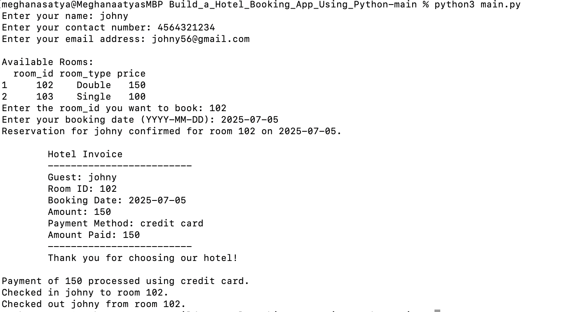
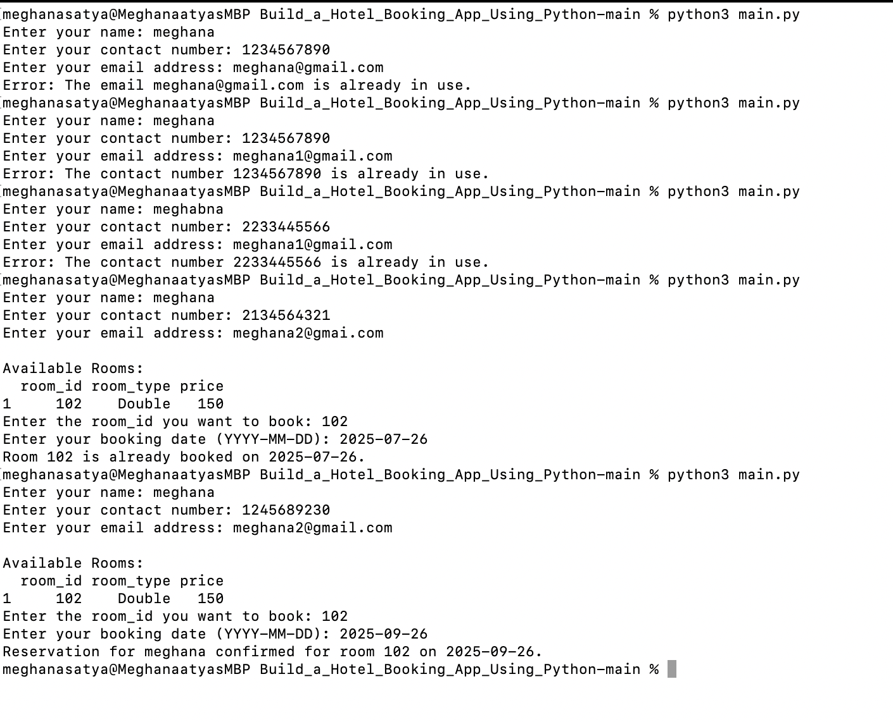

# Hotel Management System

## Overview
This Hotel Management System allows you to manage room reservations, guest information, check-ins/check-outs, room availability, and billing. It also handles the maintenance of room statuses (available, booked, occupied, clean, and under maintenance).

## Features

### 1. Room Management
- **Add Room**: Rooms are added to the system with unique `room_id`, `room_type`, and `price`. Rooms can be marked as available, booked, occupied, clean, or under maintenance.
- **Check Room Availability**: You can check whether a room is available for booking based on its status.

### 2. Guest Management
- **Add Guest**: Guests can be added to the system with their `name`, `contact_number`, and `email`.

### 3. Reservation Management
- **Reserve Room**: Guests can reserve rooms by selecting an available room and providing a booking date.
- **View Available Rooms**: Available rooms are listed, and guests can choose the room they wish to book.
- **Room Booking Status**: Rooms are marked as "booked" once reserved, and their status is updated.

### 4. Check-In and Check-Out
- **Check-In**: Rooms are marked as "occupied" once a guest checks in.
- **Check-Out**: Rooms are marked as "available" once a guest checks out.

### 5. Billing System
- **Generate Invoice**: An invoice is created for the guest reservation, showing booking details and payment information.
- **Process Payment**: Payments are processed using a specified payment method (e.g., credit card).

### 6. Room Management (Cleaning & Maintenance)
- **Mark Room as Clean**: Rooms can be marked as clean when ready for new guests.
- **Mark Room as Under Maintenance**: Rooms can be marked as under maintenance if repairs or other work is required.

## Files
- **rooms.csv**: Stores information about all the rooms (`room_id`, `room_type`, `price`, `status`).
- **guests.csv**: Stores information about all the guests (`name`, `contact_number`, `email`).
- **reservations.csv**: Stores information about all the reservations (`guest_name`, `room_id`, `booking_date`).

## Classes
- **Room**: Represents a room, provides methods for saving, listing, and checking availability.
- **Guest**: Represents a guest, provides methods for saving guest information.
- **Reservation**: Represents a reservation, allows saving reservation details.
- **CheckInOut**: Manages the check-in and check-out process.
- **Billing**: Manages invoice generation and payment processing.
- **RoomManagement**: Handles room cleaning and maintenance status.

## Example Workflow
1. A guest provides their information (name, contact, email).
2. Available rooms are displayed, and the guest selects a room to book.
3. The room's status is updated to "booked", and the reservation is saved.
4. The guest checks in, marking the room as "occupied".
5. An invoice is generated for the booking and payment is processed.
6. The room is marked as clean or under maintenance as required.
7. Finally, the guest checks out, and the room becomes available again.

## Requirements
- Python 3.x
- Pandas library (`pip install pandas`)

## Usage
To run the system:
1. Ensure the `rooms.csv`, `guests.csv`, and `reservations.csv` files are in the same directory as the script.
2. Run the script `main.py`:
   ```bash
   python main.py

## Screenshots of Application

 

 
 