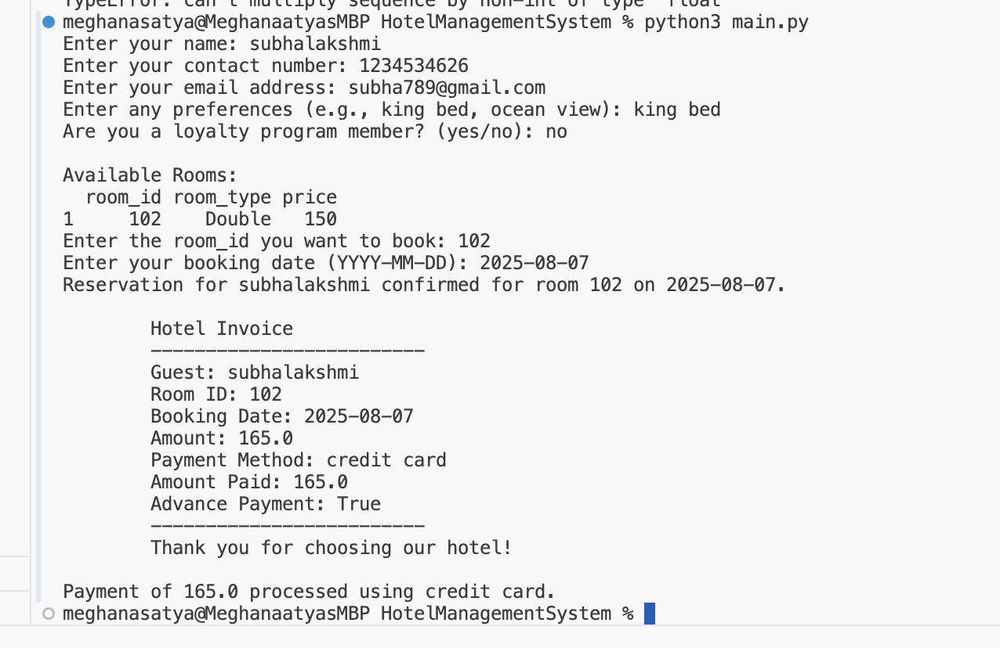
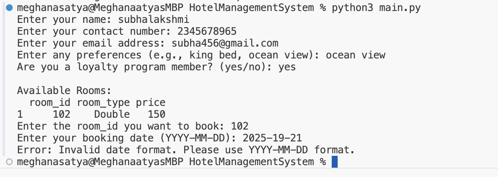
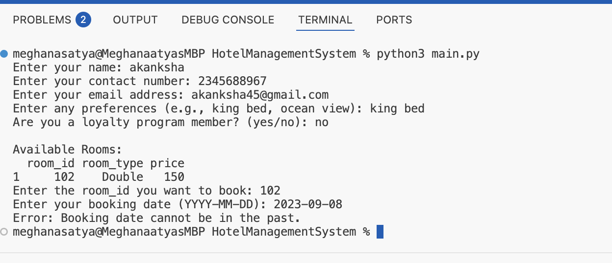

# Hotel Management System - Version 2

## Overview

This is an advanced version of the Hotel Management System, built using Python. It introduces several enhanced features to improve user experience and operational efficiency. This version provides an upgraded experience with a **Guest Management System**, **Advanced Billing System**, and **Enhanced Room Management**.

### Key Features:
- **Guest Management System**
  - Maintain detailed guest profiles, including preferences and past stay history.
  - Personalized services based on guest data.
  - Track loyalty program status for frequent customers.
  
- **Advanced Billing System**
  - Split bills across multiple guests.
  - Calculate taxes dynamically and adjust prices based on room demand.
  - Integrate with accounting software (conceptual, for future integration).
  
- **Enhanced Room Management**
  - Automate room assignments based on guest preferences.
  - Predictive maintenance alerts using room usage data.

## Installation

1. **Clone the repository:**
   ```
   git clone https://github.com/yourusername/HotelManagementSystem.git
   ```

2. **Install dependencies:**
   This system relies on `pandas` to manage data, so make sure to install it first.

   ```
   pip install pandas
   ```

3. **Prepare your CSV Files:**
   Ensure that you have the necessary CSV files (`rooms.csv`, `guests.csv`, `reservations.csv`) in the project directory to store room, guest, and reservation data.

4. **Run the Application:**
   After setting up the environment, you can run the system by executing:

   ```
   python main.py
   ```

## Features

### 1. **Guest Management System**
   - The system allows the creation of detailed guest profiles that include name, contact information, and preferences (e.g., room type, view).
   - It ensures no duplication of guest details by checking the guest’s email and contact number during registration.
   - The guest profile can also track loyalty program status, rewarding frequent guests.

### 2. **Advanced Billing System**
   - Bills can be split across multiple guests in a reservation, ensuring fair distribution of costs.
   - The price is dynamically adjusted based on the room’s demand using a multiplier system, helping with pricing strategies during high-demand periods.
   - The system generates a detailed invoice that includes information on the payment method, room costs, and loyalty discounts (if applicable).

### 3. **Enhanced Room Management**
   - Room assignments are automated based on guest preferences (e.g., King bed, ocean view, etc.).
   - The system tracks room demand and adjusts pricing accordingly using a dynamic pricing model.
   - It also provides predictive maintenance alerts, anticipating any maintenance needs based on room usage.

## Workflow

### Step 1: **Reserve a Room**
   - Guests provide their details (name, contact number, email) and preferences.
   - Available rooms are listed, and the guest selects a room.
   - The system checks if the room is available and the booking date is valid (future date).
   - After confirming, a reservation is made, and the room is marked as "booked."

### Step 2: **Billing**
   - After booking, the system generates an invoice.
   - It calculates the price, including taxes, and processes payments based on the provided payment method (e.g., credit card).
   - It supports advance payments, allowing guests to pay a deposit or full amount upfront.

### Step 3: **Check-In/Check-Out**
   - Once the payment is processed, guests can check-in to their rooms. Room status is updated to "occupied."
   - On check-out, the room status is updated to "available."

## Data Files

### 1. `rooms.csv`
   Stores information about the rooms, including:
   - **room_id**: Unique identifier for each room.
   - **room_type**: Type of room (e.g., Single, Double, Suite).
   - **price**: Price per night.
   - **status**: Current status of the room (available, booked, occupied).
   - **room_demand**: Tracks demand to adjust pricing dynamically.

### 2. `guests.csv`
   Stores guest information, including:
   - **name**: Guest's full name.
   - **contact_number**: Guest's contact number.
   - **email**: Guest's email address.
   - **preferences**: List of guest preferences (e.g., bed type, room view).
   - **loyalty_program**: Boolean indicating whether the guest is part of a loyalty program.

### 3. `reservations.csv`
   Stores reservation information, including:
   - **guest_name**: Name of the guest who made the reservation.
   - **room_id**: The room reserved.
   - **booking_date**: Date of the reservation.

### Screenshots for Advance Features

 

------

 

------

